# Sailor MERN
### By Alex Diwa, Alyssa FitzGerald, Leah Hou and Natasha Khatri

### App URL
http://sailor-mern-leah.s3-website-ap-southeast-2.amazonaws.com/

### GitHub Repos
- Back-End (Express): https://github.com/tashk85/sailor_mern_backend
- Front-End (React): https://github.com/lyssfitz/sailor_mern_frontend

## Description Of Project
Our web application is intended to enable early-stage start-ups to start building an audience by curating and crowd-sourcing content relevant to their industry. For this project, we focused on the health industry. 

## Problem Definition / Purpose

The app aims to help a start-up – in this case, DigitalHealthX, a company in the Digital Health industry that wants to build an audience in the early stages of their company. 

Traditionally, a company would start their own blog to attract people who are interested in their industry. However, with the increasing number of information sources available, it's difficult to get noticed in the crowd. This app gives DigitalHealthX the platform to build an audience of people, which has content relevant to their industry. 

This is achieved by sourcing articles and content through RSS Feeds, which can be sorted according to "interest tags" or keywords. The user is able to choose which interest tags they want to follow, allowing them to read all relevant content within the one application instead of needing to visit several different sites. 

DigitalHealthX believes that this would be more engaging than a blog or traditional content with people facing increasing levels of digital "noise" through notifications and emails.

## Functionality / Features

Users will have the ability to:
    
* View a landing page that directs them to either sign up or login to view content.
* Sign up for a new account using their email or through LinkedIn as an OAuth provider (and have this information stored in the database)
* Login to their existing account (retrieving said information from the database)
* Select and save their interests tags from a form e.g. 'Digital Health', 'TeleHealth', 'Devices'.
* View a curated feed of articles that relate to the interest tags chosen.
* Select an individual interest tag/category and filter the feed according to that category.
* View an individual article within the app.
* Like, Share and Comment on an article.
* Mention another user in their comment on an article.
* View their profile page, which shows their:
    * Full Name
    * Linkedin profile (if they used Linkedin OAuth to sign in)
    * Interest tags 
    * Articles they have liked
* Edit their interest tags according to what content they want to see.
* Logout of their account.

## Screenshots

### Landing Page
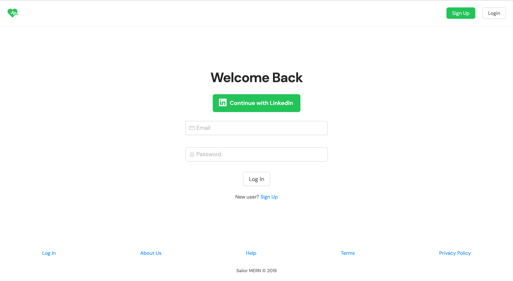

### Login Page

### Signup Page
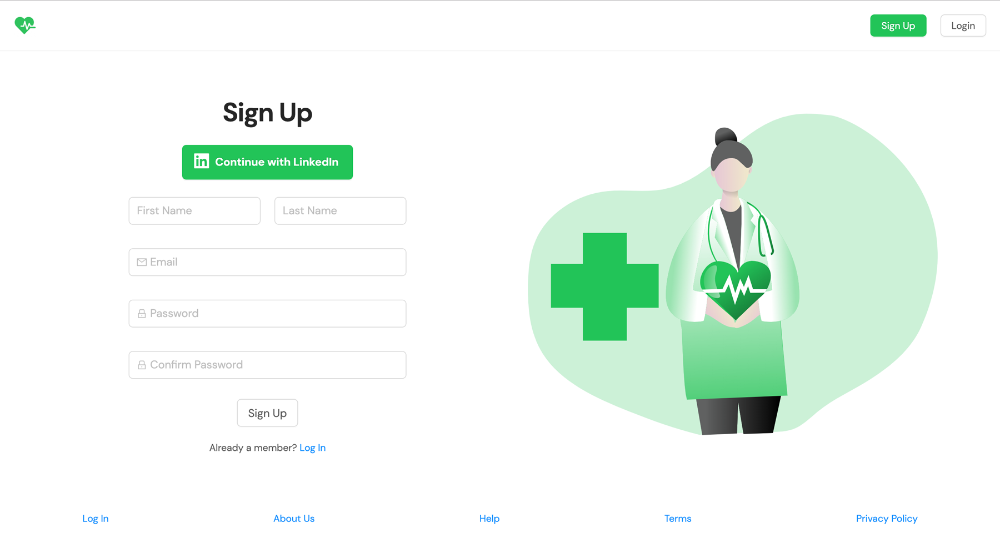

### Interests Form
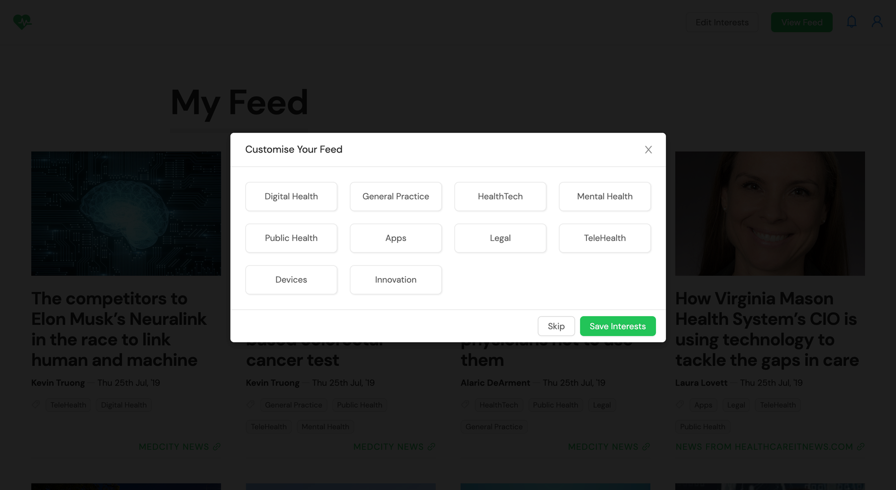

### General Feed Page
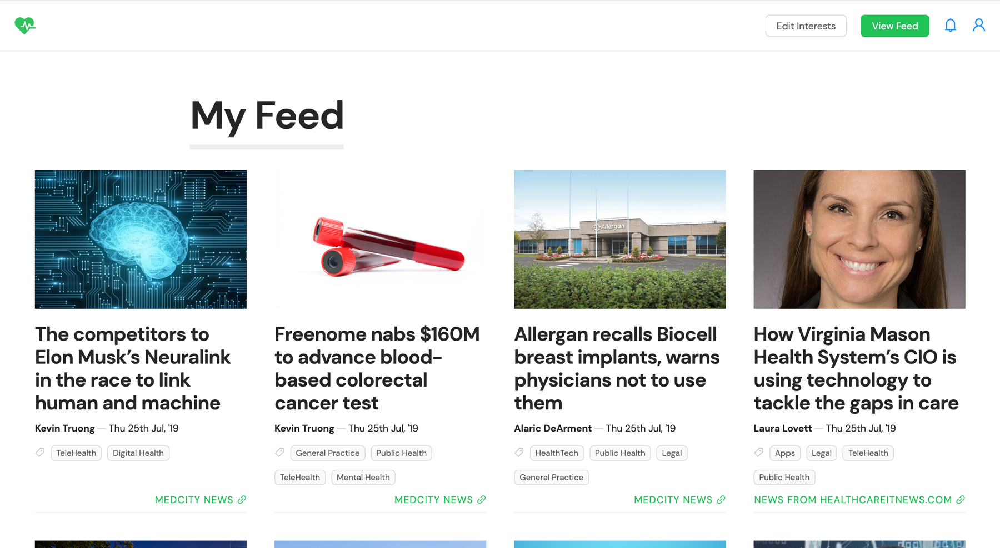

### Curated Feed Page
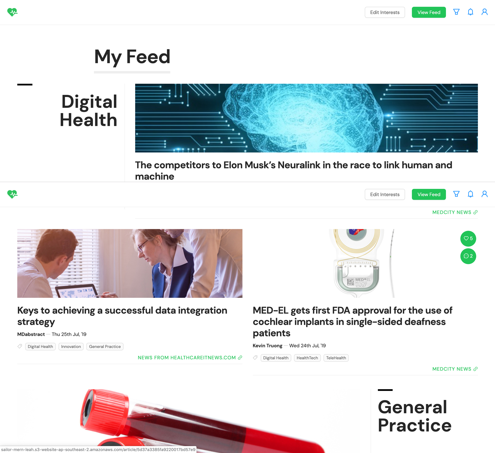

### Filtered Feed Page
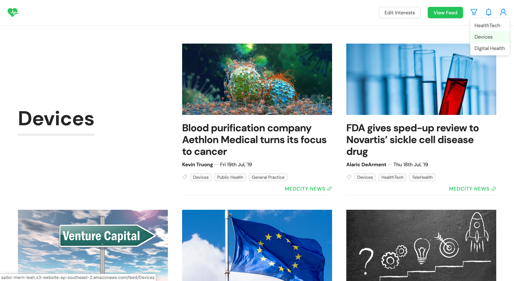

### Individual Article
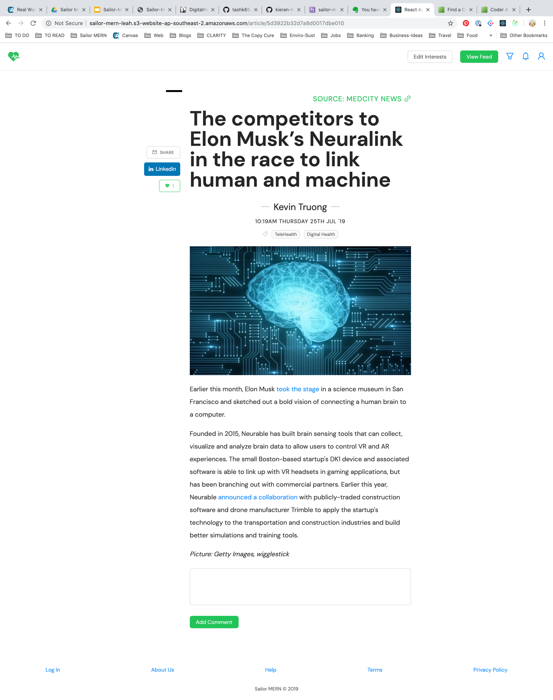

### Comments on an Individual Article
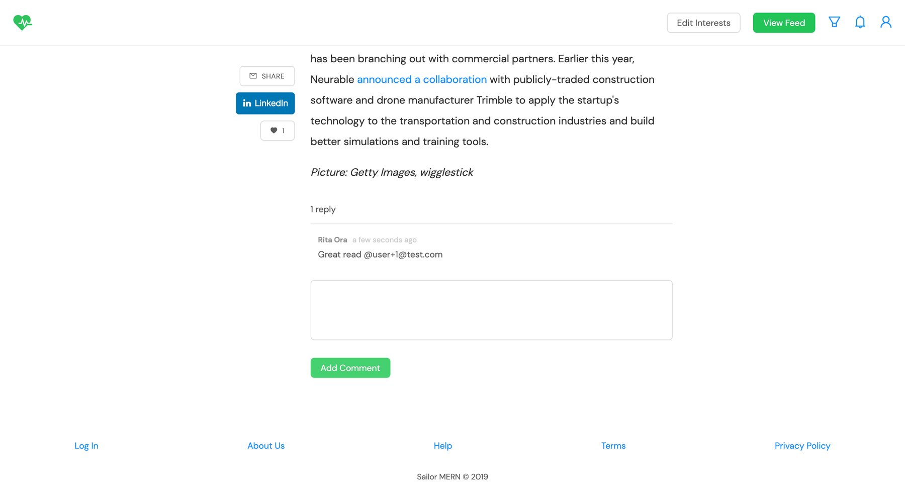

### Comment Mentions on an Individual Article
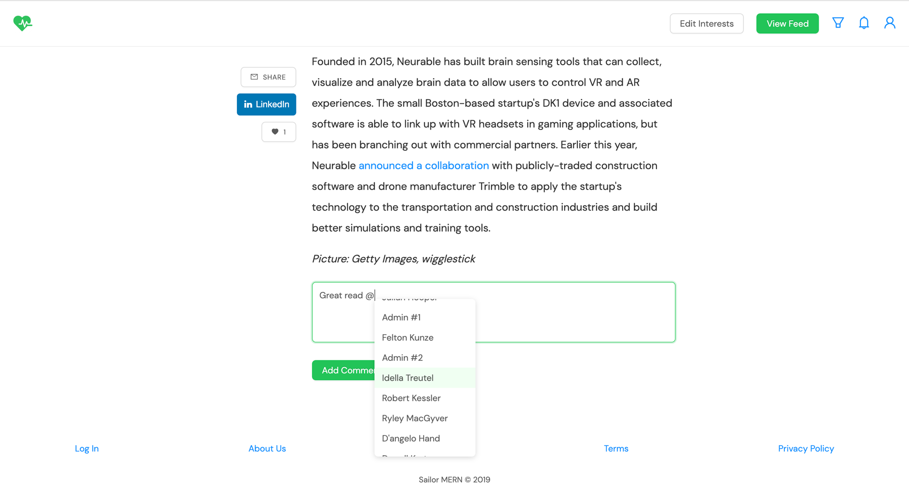

### Profile Page
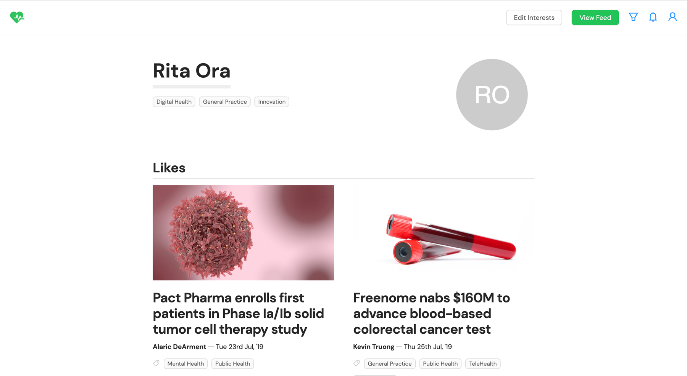

### Notifications Page
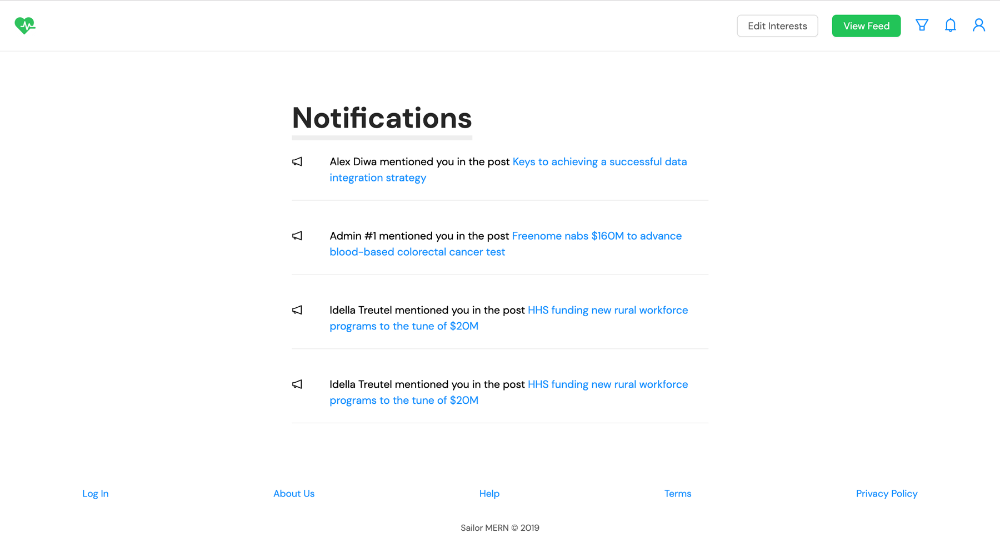

### Admin View - Add An Article
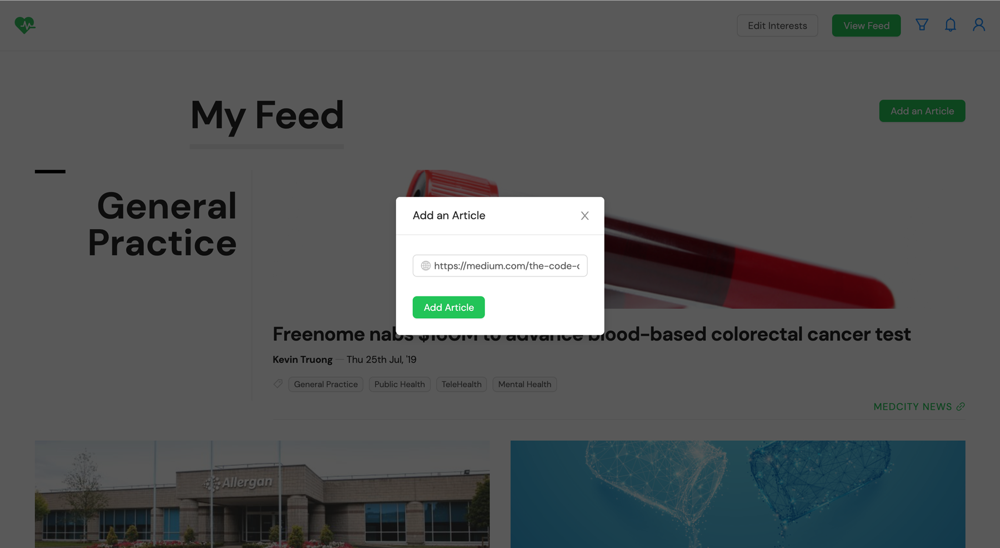

### Tech Stack

For the tech stack on this project we are using a combination of front- and back-end technologies.
- MongoDB 
- Express.js
- React/Redux
- Node.js
- HTML
- CSS (Grid & Flexbox)
- Ant Design component library
- Heroku for deployment of Express app
- AWS S3 for deployment of React app
- GitKraken / Github for version control
- Monday & Trello boards for project management
- Google Sheets / Google docs for docs, planning and organization
- Cypress for automated testing

## Instructions on how to setup, configure, deploy and use your App

To use the live app, go to http://sailor-mern-leah.s3-website-ap-southeast-2.amazonaws.com/ and set up an account.

For local use of the app, perform the following operations:

**Express Server:**
- From a bash CLI, clone the back-end git repository locally: `git clone https://github.com/tashk85/sailor_mern_backend.git`
- Move into the directory: `cd sailor_mern_backend`
- Install npm packages: `npm install` or `yarn install`
- Ensure mongoDB is running
- Create a .env file in the root directory, with the following variables: DB_HOST set to mongodb://localhost/backend, PORT set to 3000, SESSION_SECRET to any password, JWT_SECRET to any password, LINKEDIN_KEY and LINKEDIN_SECRET to your LinkedIn Developer credentials, REACT_URL to your react server URL http://localhost:3001.
- Start the server: `npm run server`

**React App:**
- From a bash CLI, clone the front-end git repository locally: `git clone https://github.com/lyssfitz/sailor_mern_frontend.git`
- Move into the directory: `cd sailor_mern_backend`
- Install npm packages: `npm install` or `yarn install`
- Create a .env file in the root directory with variable REACT_APP_API_URL set to your node server URL http://localhost:3000.
- Start the server: `npm start` or `yarn start`, when prompted to change port say yes (Y).
- This will automatically open up the application in your browser, if not, go to http://localhost:3001
- Enjoy!

## Design Process
Our design process began with gathering requirements from the client, which we formed into user stories. We then created a user workflow diagram that helped us to define the overall scope of the project. With this information, we created our wireframe designs for desktop and mobile versions. With user stories, user workflow and wireframes finalised, we created a database schema diagram which defined how our models were designed and how they interacted with each other. This, in turn, informed our component design and what methods we needed to write to build an app that functions as intended.

## User Stories

- As a startup, I want a platform where I can show regular articles related to my industry so that I can build a client base.

- As a general user, I want to access all articles related to a particular industry without having to visit several different websites.

**General App User**

- As a user, I want to sign up and create my profile on the website using my LinkedIn account.

- As a user, I want to sign up and create my profile on the website using my email.

- As a user, I want to sign up and select my interest tags so that I can choose the content I see.

- As a user, I want to like, comment and share articles with others.

- As a user, I want to view my profile so that I can see my selected interests and articles that I have liked.

- As a user, when I sign in I want to see a curated feed of articles that match my interest tags.

- As a user, when I sign in I want to be able to filter my feed by interest tags so that I can see stories that match a particular tag.

- As a user, I want to see the number of likes on an article.

- As a user, I want to be able to mention other users in the comments of an article.

- As a user, I want to receive a notification if another user mentions me in the comments of an article.

- As a user, I want to read articles in the app according to my screen size.

- As a user, I want to receive push notifications that show me the top content related to my interest tags. (stretch goal)

- As a user, I want to be able to change the frequency of my notifications. (stretch goal)

**Admin User**

- As an administrator, I want to be able to do all functions that a general user can do.

- As an administrator, I want to be able to add additional articles to the site.

- As an administrator, I want to be able to view and approve user submissions. (stretch goal)

- As an administrator, I want to be able to delete content including articles and comments that are inappropriate. (stretch goal)

## User Workflow Diagram:

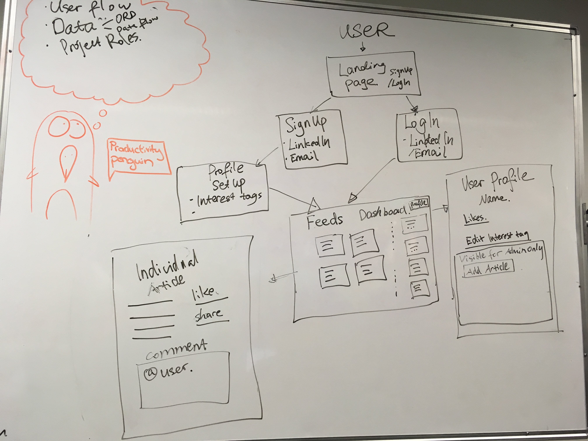

## Wireframes:
### Landing Page

### Signup Page
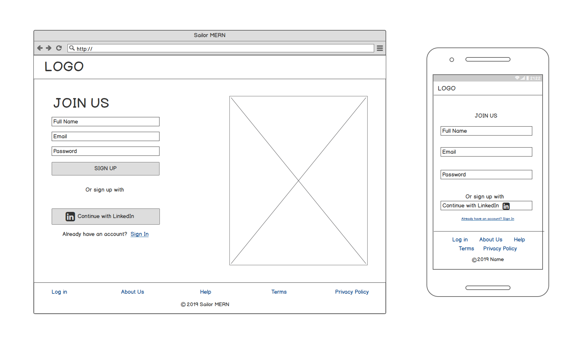

### Login Page
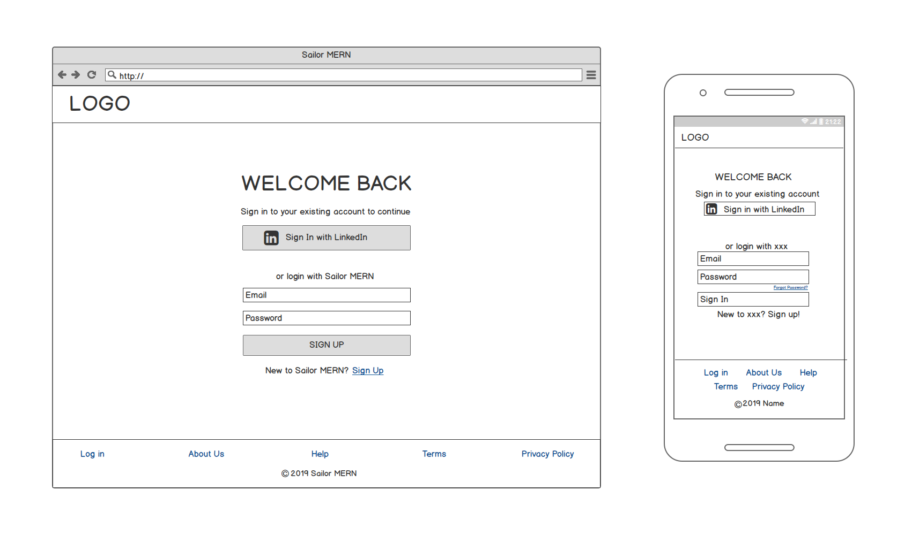

### Interests Form

### Feed Page
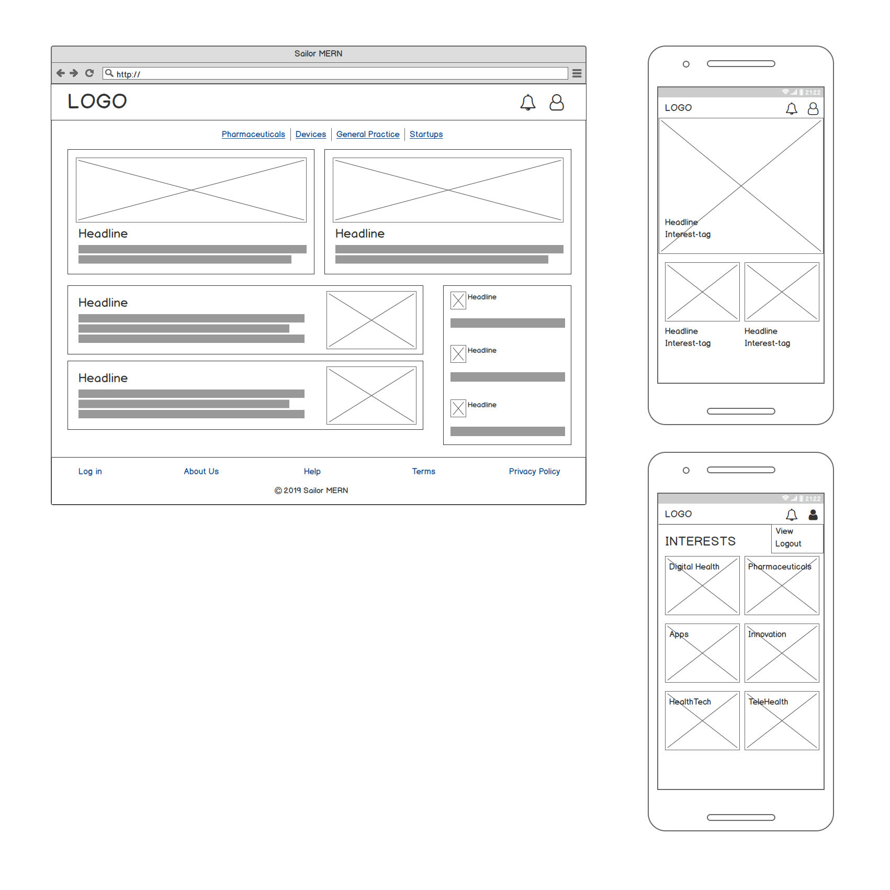

### Individual Article
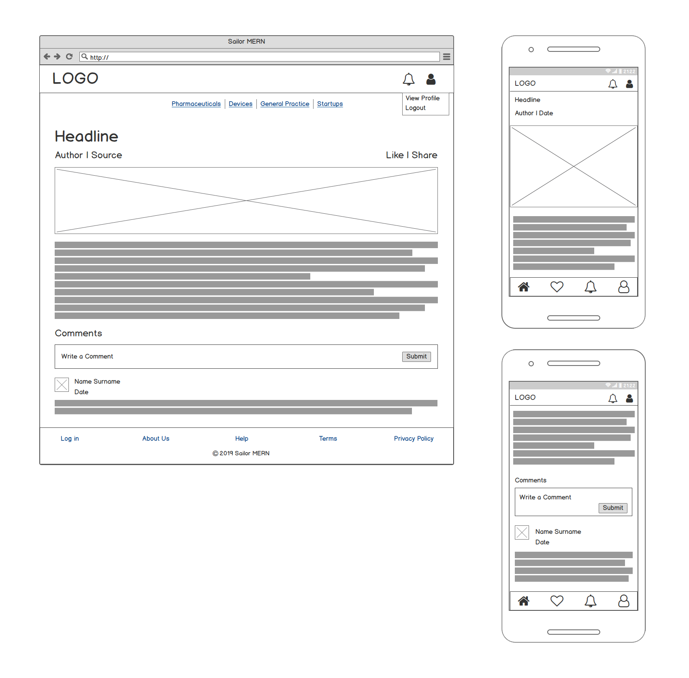

### Profile Page
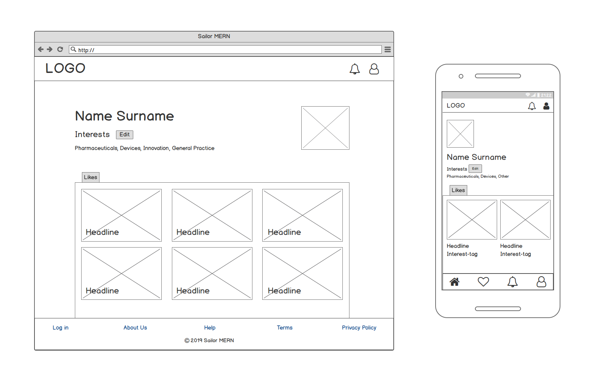

### Notifications Page

### Admin View - Add An Article

## Database Entity Relationship Diagram:
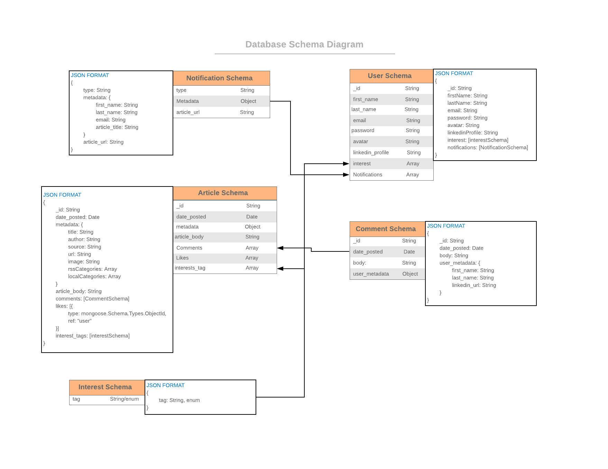

## Data Flow Diagram:
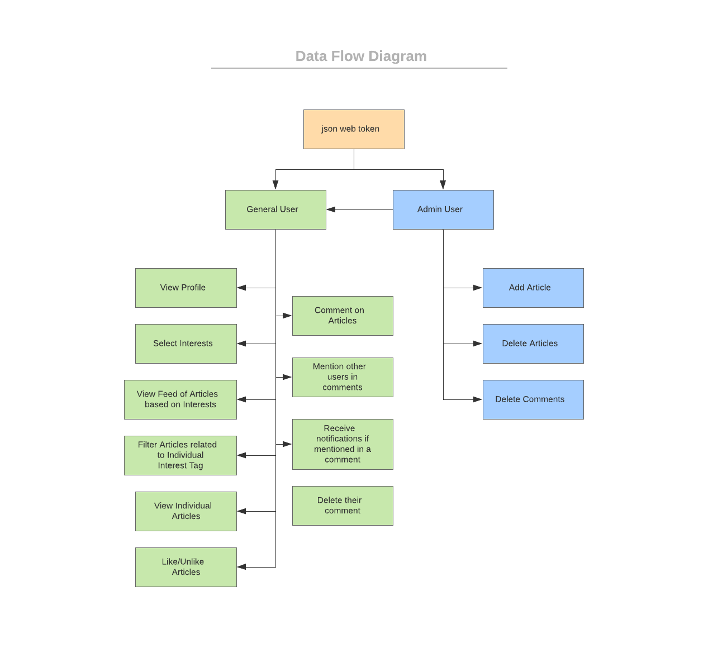

## Object Orientated Design Documentation:
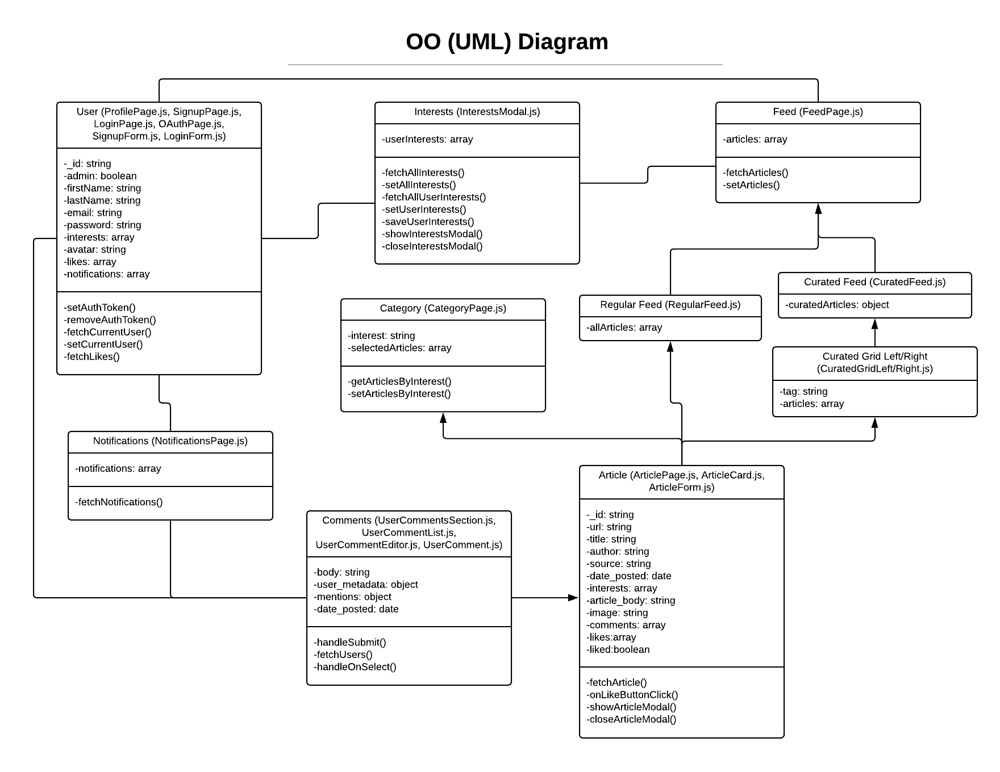

## Project Management & Planning
### Project Plan & Timeline
Our project plan was to find a client before the 8th of July so that we would have more time to complete the client's project requirements as well as preparing our documentation and presentation materials. 

After reviewing a few possible client projects, we decided to go with DigitalHealthX (DHX) as our client. The first day was spent having a meeting with DHX to gather a better understanding of their requirements and clarifying the scope and scale of the project and any points of uncertainty. We then developed a Scope of Work as our informal 'contract' to clearly outline our MVP and the terms of our services, which we had signed and confirmed by the client on 9th July. 

Once we had the MVP outlined, we were able to start working on the user workflow, wireframes and fleshing out user stories. From this we then developed our schema design to understand how we would be retrieving, modifying and storing data.

During the planning stage, we also created kanban boards to show tasks that were required overall and also broke these down into sprints. We used agile methodologies, Monday and Trello to keep track of our progress.

We assigned team roles to everyone with Alex as Tech Lead, Alyssa as Client Management, Leah as Project Management and Natasha as General Management. This reflected what we were responsible for throughout the project although we did work across areas as well.

For team communication, we had daily team meetings or standups when in class, and also regularly updated team members on things over Slack. We also pair programmed for various features such as RSS Feed setup, Passport strategy setups, etc, which was a great experience as we problem solved by learning and bouncing ideas off each other.

[Project Timeline / Schedule](./docs/Project-Timeline.pdf)

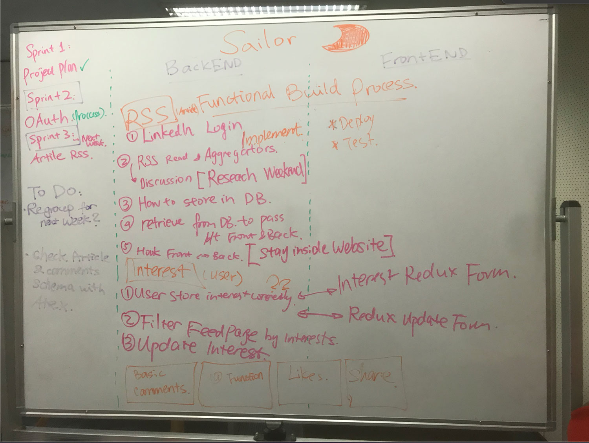

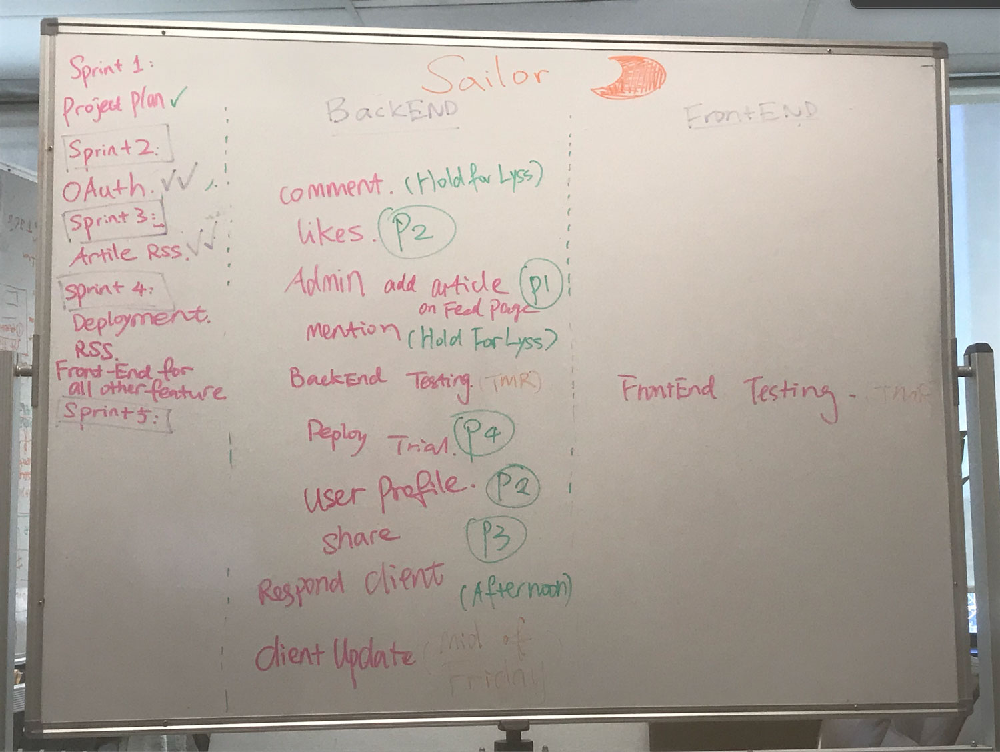

### Client Communications
We kept in contact with DigitalHealthX ("client") throughout the project, asking questions and providing updates and feedback. Since our communication with DHX was done remotely, we communicated with them primarily using Slack and email along with phone calls including an initial Zoom conference meeting.

***Note for Coder Academy Educators: For Client documentation and evidence please refer to the /docs directories of our individual project submissions.***

**Client Communications Diary**

| **Date**/s        | Description                                                  | Submission Filename/s                                        |
| ----------------- | ------------------------------------------------------------ | ------------------------------------------------------------ |
| 28/6/19 -  1/7/19 | Sailor-MERN initial contact with client explaining proposal of completing a project for them on a voluntary basis as part of our completion requirements for our Diploma of IT. | 2019-06-28-initial-contact.png, 2019-07-01-explain-reqs.png  |
| 1/7/19            | Client emailed written proposal for project through.         | 2019-07-01-client-proposal.png                               |
| 5/7/19            | Sailor-MERN email to client confirming interest in proceeding and organising to set up client meeting to discuss. | 2019-07-05-confirm-proceeding.png                            |
| 8/7/19            | Sailor-MERN Zoom meeting with client discussing client requirements in more detail. | 2019-07-08-zoom-minutes.pdf                                  |
| 9/7/19            | Sailor-MERN email to client with draft Statement of Work (SOW) and clarifying some details. | 2019-07-08-draft-sow.png                                     |
|                   | Client email to Sailor-MERN confirming agreement to SOW with modifications. | 2019-07-09-client-sow-modifications.png                      |
| 10/7/19           | Updated SOW emailed to client incorporating modifications.   | 2019-07-10-modified-sow.png                                  |
|                   | SOW sign-off from client and suggestion of RSS feeds for project. | 2019-07-10-client-sign-off.png                               |
| 10/7/19 - 15/7/19 | SOW countersigned by Sailor-MERN and discussing best method for further communications. | 2019-07-10-comms-disc.png, 2019-07-10-sow-signed.pdf         |
| 15/7/19 - 16/7/19 | Client welcomes Sailor-MERN to their Slack channel, Sailor-MERN gives progress update. | 2019-07-15-slack-update.png                                  |
| 16/7/19           | Discussion around LinkedIn OAuth key usage.                  | 2019-07-16-linkedin-oauth1.png, 2019-07-16-linkedin-oauth2.png, 2019-07-16-linkedin-oauth3.png |
| 19/7/19           | Further Sailor-MERN update to client on Slack & client feedback. | 2019-07-19-further-update.png                                |
| 22/7/19           | Provide first run of production site to client & client feedback. | 2019-07-22-initial-production.png                            |
| 22/7/19 - 23/7/19 | Discuss RSS feeds and client concerns re. compliance with RSS feed owners' terms and conditions. | 2019-07-22-rss-disc1.png, 2019-07-22-rss-disc2.png           |
| 23/7/19 - 24/7/19 | Provide updated production site to client and guide for user testing, client completion of user testing. | 2019-07-23-production-testing1.png, 2019-07-23-production-testing2.png, 2019-07-23-clienttesting-julian.pdf |
| 24/7/19 - 25/7/19 | Sent and received Client Feedback Survey and received client user testing and survey feedback. | 2019-07-25-client-feedback-survey.pdf                        |
| 25/7/19           | Sent handover document to client                             | 2019-07-25-handover-documentation.pdf                        |

### Screenshots of Project Management Board(s)

For this project, we used Monday.com's boards for project management. We split tasks into sprints, which defined tasks in more detail according to the feature we were working on. This helped us see everything at a glance and helped us to track our progress. 

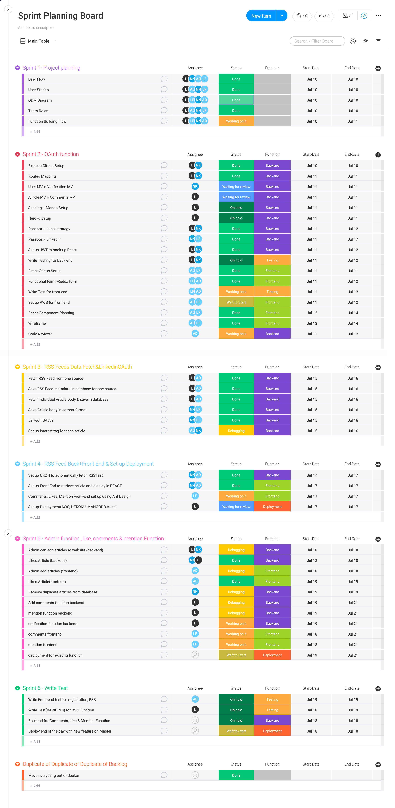

Towards the end of the project, we switched to using Trello boards. We based the kanban board tasks off our Monday boards format and also included user stories to clearly identify features we were aiming to incorporate into our MVP.

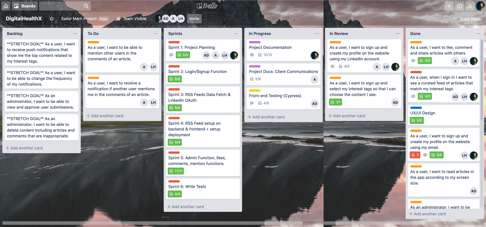

### Overview and Description of Source Control Process

Our group used Git and GitHub for source control, and GitKraken for visualisation of our workflow. Management of our version control was essential as we had to work in two different repositories corresponding to our back- and front-end codebases. At the early stages of the project, we worked off branches off a 'dev' (development) branch, which was a direct branch off the master branch. From the 'dev' branch, we created individual branches that corresponded to features we wanted to implement, or while performing testing with Jest and Cypress. Examples of these branches are: 'rss_feature', 'likes', 'comments', 'notification', 'profile', 'shares', 'linkedin-oauth'. We communicated frequently over Slack and in person to keep track with changes we had pushed and merged/pulled into dev, so that others could work on the most up-to-date code. Later on in the project when deploying, we worked directly off the master branch when making smaller changes, which were then merged and deployed immediately after discussing with the group. 

## Short Answer Questions
### 1. What are the most important aspects of quality software?

1. **Functionality** of the software is an important aspect as it must perform the required functions in order to serve its purpose and deliver value to a user. For example, an ATM machine provides numerous functions from checking your bank account balance to withdrawing and depositing cash. If an ATM machine did not allow withdrawals, an essential function of this software would be missing, which would make it poor quality.

2. **Reliability** of the software is important in terms of its capability to perform services under specified conditions over specified periods of time. For example, the recent Telstra systems outage which caused network issues for eftpos machines was due to an increased surge in network traffic. However, once this was fixed, the software was able to recover and continue functioning.

3. **Usability** of the software is important in terms of the ease with which a user can use the software, learn to operate the software and interact with it via the user interface. For example, links on a website should be clearly identifiable through use of hover effects or text to show that an action can be taken.

4. **Efficiency** of the software is important to show how the software performs in terms of its use of time and resources such as disk space and memory. For example, if an ATM machine took 30 minutes to dispense cash it would greatly affect its efficiency and therefore also reduce usability.

5. **Maintainability** of the software is important in terms of the ability to fix, update and modify software to improve its performance or to correct faults. This can also be impacted by the legibility and complexity of code used. For example, a smart phone requires regular software updates to fix bugs and add new functionality. This improves the user experience and therefore reflects high quality software.

6. Software **Security** is an essential component of quality software due to the increasing potential for having vulnerabilities where sensitive information can be exposed, or the occurrence of cross-site scripting and SQL injection. By taking precautions for security during the development process of software such as controlling the type of input accepted by forms, sensitive user information is protected.

#### 2. What libraries are being used in the app and why?

- **Express** is the Node web server framework that allows us to create all the routes that our React app will use to request and post data
- **Node** is used to run JavaScript and install packages.
- **CORS** is being used to accept cross origin requests from our React application.
- **Mongoose** is being used to handle creating our model schemas and for querying the MongoDB database.
- **Dotenv** enables us to load environment variables from our .env file which stores our applications private information such as passwords and API keys.
- **Mongoose-bcrypt** enables us to encrypt and verify user passwords in the database.
- **Celebrate** is being used for validation to ensure all user inputs are correct before handing it down to functions.
- **jsonwebtoken** is being used to generate json web tokens which authorise users to access the application.
- **Passport** is being used for authentication of requests and allows us to direct users to correct routes according to their authorisation status.
- **Passport-jwt** is being used to authenticate requests using a json web token.
- **Passport-local** is being used to allow users to login using email and password which is authenticated and stored locally on the database.
- **Passport-linkedin-oauth2** is being used to allow users to login using LinkedIn OAuth strategy and allows us to access basic profile information from their accounts.
- **Axios** is being used to handle HTTP requests on our routes between Node/Express server and React application.
- **Cron** is being used to allow us to execute a function on a timed schedule.
- **Article-parser** is being used to extract the main article, image and meta-data from a given URL.
- **RSS-parser** is being used to turn RSS XML feeds into Javascript objects.
- **React** is being used to create the front-end interface.
- **React-dom** is being used to render components.
- **React-router-dom** is being used to route to specific components depending on the URI.
- **React-redux** is being used to handle state in a centralised store.
- **React-scripts** enables us to run scripts from the command line.
- **Redux-thunk** allows us to write asynchronous action creators that return a function instead of an action.
- **React-html-parser** is being used to convert HTML strings from the article-parser into React components.
- **Query-string** is being used to parse and stringify URL query strings. We use this specifically for Linkedin OAuth.
- **Ant Design** is a React component library that allows us to style our components quickly. It makes the development process easier and enhances the experience (UI/UX) for the user.
- **Styled-components** allows us to style individual components and elements with CSS, as well as customise imported Ant Design components.
- **Jest** is being used as our testing framework.
- **Cypress** is being used for end to end and integration testing.

#### 3. A team is about to engage in a project, developing a website for a small business. What knowledge and skills would they need in order to develop the project?

The team would need to have a good understanding of web technologies including how the internet works and HTTP protocols. This would also involve having technical skills and a sound, working knowledge of HTML and CSS, testing and deploying. To be able to create a more complex and dynamic website they would need to familiar with frameworks such as Ruby on Rails or the Javascript MERN stack, which would also involve knowledge of database design. 

Project management and planning skills would allow the team to plan the project by dividing tasks among team members, keep on track with tasks and keep everything organised using tools such as Trello or Monday. Project planning skills also include being able to take requirements from the client and forming user stories, user work flows and wireframes. 

Communication skills are necessary for the team to work effectively, as they need to collaborate on tasks, share information and update team members on task progress. They would also need to communicate with the client in regards to scope of work, design approvals and to share progress of the website. It would also be advantageous for the team to have knowledge in version control using git to allow team collaboration when coding the website.

#### 4. Within your own project what knowledge or skills were required to complete your project, and overcome challenges?

We required a good understanding of the MERN stack as this formed the basis of our project. Central to building in functionality into this app was a strong understanding of HTTP requests, and knowledge of how data flows through the app, and the methods/processes needed to fetch, manipulate, store and present that data. Specifically, we needed a working knowledge of MongoDB and Mongoose for data storage, Express.js to create the server and routes for the front-end to handle HTTP requests, and React to retrieve and render the data to the user. Working within this tech stack, we also required knowledge of Javascript, JSX, HTML and CSS, which together allowed us to build the application and style the user interface. 

Knowledge of git for version control was required as we had to continually keep track of changes in our source code, as well as work on separate branches for individual features or tasks. With multiple people working on the same repository, constant communication was required to keep merge conflicts to a minimum.

UI/UX design skills were required for styling the application, which was further enhanced by using libraries such as Ant Design and styled-components to improve the user interface, and help get an MVP up and running relatively quickly. This also enabled us to make the application responsive and mobile-friendly which was one of our MVP requirements.

Knowledge of express middleware, JSON web tokens, Passport and Celebrate was required to implement the authentication, authorisation and validation of users accessing the application as well as associated form fields. We encountered some challenges when implementing the LinkedIn OAuth strategy with outdated documentation as well as some difficulty reaching the callback api and sending the authorisation token to the front-end. We eventually sourced a package that had updated the strategy, edited the controller method to send a redirect url with a token in the params for the front-end to extract and use for authorisation of the user.

Debugging was a key skill that was crucial to overcoming technical challenges throughout the coding process as well as when deploying to production. We gained ample experience learning how to interpret error messages, and how to troubleshoot HTTP requests and methods on the front- and back-end. To deploy our site, we also required knowledge of MongoDB Atlas, Heroku and AWS S3 buckets.

Agile methodologies helped us plan and manage our development process. This included planning through creating user stories, creating a work scope for the client to agree on MVP, tracking our progress through use of Monday and Trello boards, collaborating with standups and team meetings, and communicating progress with the client.

#### 5. Evaluate how effective your knowledge and skills were in this project, using examples, and suggest changes or improvements for future projects of a similar nature?

- Alex - "I have a good working knowledge of the technical aspects of building an app, and I helped guide our team on both the front- and back-end. I am stronger on the front-end and led the React component design and implementation, for example, for the curated feed and article pages. My weaknesses are in planning, prioritising and documentation, and thankfully I had supportive team members who could learn from and who could guide me in other aspects throughout the project timeline. For future projects, I could benefit from being better at time management, having a more in-depth understanding of the the component lifecycle and making my code cleaner, more efficient and performant."

- Alyssa -"I felt that my strengths in the project were in leading the team's interactions with the client and ensuring as best as I could that we were building the project in line with the client's preferences. I am still enjoying a learning curve with the technical aspects of the project and spent quite a lot of time researching and considering the best way to organise the technical aspects that had been assigned to me such as working with React on the front-end to build the comments components. After some research I felt that I started to get a good process down with using a couple of different tools for testing but given the time limit and scope of the project I wasn't able to develop this as fully as I would have liked. It was also a great challenge to work on the LinkedIn OAuth on the back-end and expand my knowledge of implementing OAuth beyond what we learned in class. In the future I think I would benefit from thinking in more detail earlier in the process how I am going to link the front-end components to the back-end."

- Natasha - "I started off not very confident with my knowledge in using the MERN stack. However, my knowledge and skills have definitely improved and I understand how the stack works in much greater depth. My strengths were in creating documentation, and working on the back-end express server including setting up passport strategies. I learnt a lot from my team and really enjoyed pair programming for various features as this helped me to better understand the concepts behind the code we were writing, for example, the RSS feed fetching and CRON job. Although I got some exposure to setting up React and Redux, I would like learn more about how React and Redux work together. My take-aways from this project are to improve on my planning and problem solving skills, regularly implement testing using frameworks like Jest and to just keep practicing concepts that I don't understand until I do (practice makes progress)."